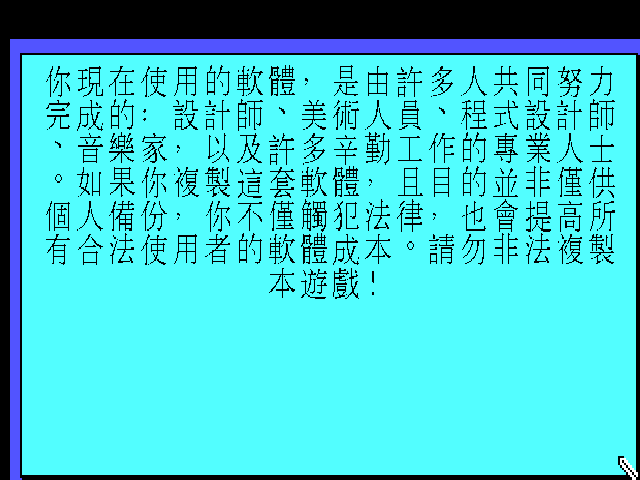
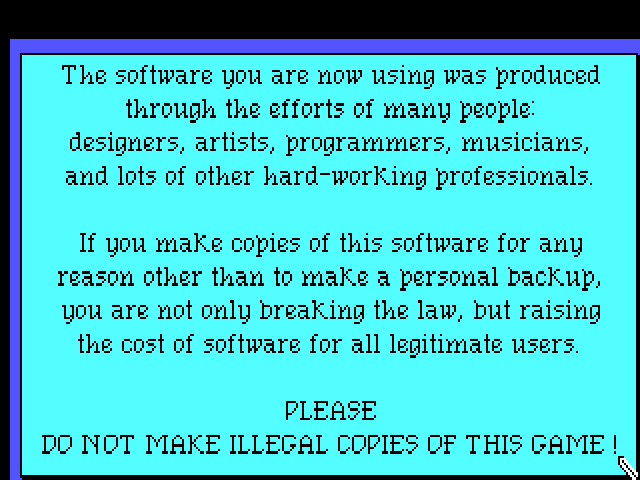
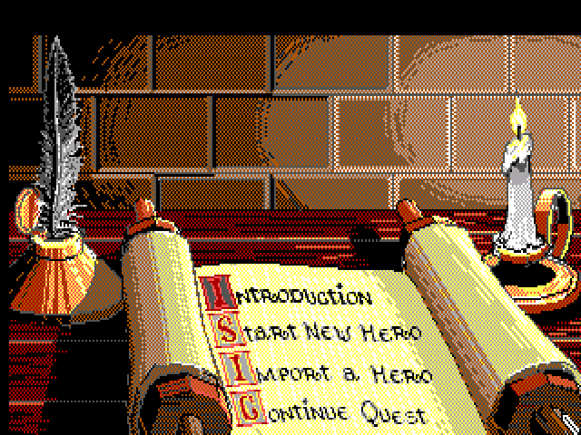
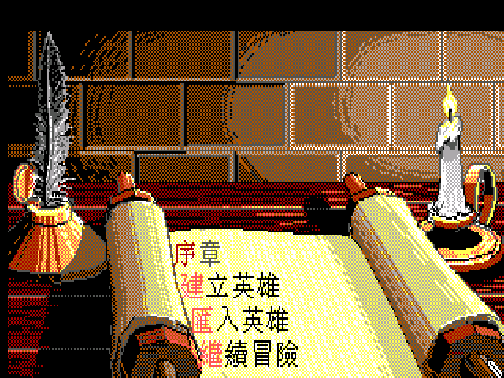

# 英雄傳奇 II：試煉之火 — 繁體中文化（ScummVM / SCI0 EGA）

> **Quest for Glory II: Trial by Fire** — Sierra 1990 年的經典角色扮演冒險遊戲，如今可以用中文重玩一次。

這個專案把 1990 年 EGA 版《英雄傳奇 II》的遊戲文字、選單全面中文化，透過 ScummVM 執行。你不需要懂英文，也能走完夏皮爾與拉希爾的整段冒險。

---

## 目錄

- [這是什麼遊戲](#這是什麼遊戲)
- [承先啟後的第二章](#承先啟後的第二章)
- [三種英雄，三種玩法](#三種英雄三種玩法)
- [練功，不是升級](#練功不是升級)
- [中文化成果](#中文化成果)
- [技術要點](#技術要點)
- [怎麼玩](#怎麼玩)
- [交付原則](#交付原則)
- [致謝](#致謝)

---

## 這是什麼遊戲

《英雄傳奇 II：試煉之火》是 Sierra On-Line「Quest for Glory」系列的第二作。你扮演一名剛從史匹堡揚名的年輕英雄，隨著卡塔族商人來到阿拉伯風情的沙漠城市**夏皮爾**。原本只是護送旅程，卻捲入四大元素（火、水、土、風）接連降臨的災難，最終要深入墮落的姊妹城**拉希爾**，對抗巫師阿德·阿維斯與惡魔伊布利斯。

它揉合了「冒險解謎」與「角色扮演」：你既要打字下指令探索世界、跟 NPC 對話解謎，也要練技能、打怪、管理體力與金錢。1990 年的 EGA 版是**打字輸入**的 parser 版本，原汁原味保留了當年的操作手感。

## 承先啟後的第二章

這一作直接承接《英雄傳奇 I》的主角——你可以把一代通關的角色**匯入**二代繼續養成。故事從史匹堡山谷來到中東風格的沙漠都會，美術、音樂、文化設定都換上一千零一夜的色彩，是系列公認氣氛最濃郁的一作。

## 三種英雄，三種玩法

創角時選擇職業，決定你的解謎路線：

- **戰士**：正面對決，靠武力與體格突破難關。
- **法師**：施展火焰、力擊、浮空等咒語，用魔法巧解機關。
- **盜賊**：開鎖、潛行、爬牆，走旁門左道。

三種職業面對同樣的謎題，卻有各自的解法；玩到後期若聲望足夠，還可能踏上隱藏的**聖騎士**之路。

## 練功，不是升級

這個系列沒有傳統的「經驗值升等」。你**用什麼、什麼就會進步**：常揮劍，力量與武器技能上升；常施法，魔力增長；常爬牆潛行，敏捷變高。想變強，就得真的去做那件事——這套「熟能生巧」的成長設計，是 Quest for Glory 最迷人的特色之一。

## 中文化成果

| 畫面 | 英文原版 | 繁體中文化 |
|---|---|---|
| 版權／反盜版框 |  |  |
| 主選單卷軸 |  |  |

**進度**：

- ✅ 遊戲文字中文化 **98%**（6455 / 6522 則）：對白、旁白、系統訊息、選單、道具、動態句。
- ✅ 主選單卷軸選項重繪中文美術（序章 / 建立英雄 / 匯入英雄 / 繼續冒險）。
- ✅ 中文以 640×400 高解析銳利呈現，斷行、行首字完整。
- ✅ Roland MT-32 音樂支援（自備 ROM）。
- ⏳ 序章標題、片尾製作名單美術（後續增強）。

> 未中文化的 67 則為遊戲內部除錯字串（正常遊玩不會顯示）。

## 技術要點

- **引擎**：ScummVM `sci` 引擎，SCI0 EGA 軌（game id `sci:qfg2`）。
- **內容為 key 的替換**：以英文原文為索引查繁中譯文，查無則露原文；引擎啟用 `--language=tw` 進中文模式。
- **高解析中文**：SCI0 EGA 本無內部 hi-res buffer，中文啟用時強制 640×400 並載入 32px Big5 字模直繪，對白銳利不馬賽克。
- **譯文複用**：系列同劇情的 VGA 重製版譯本（qog-2）提供 44% 的複用基礎，其餘由批次翻譯補完並統一術語。
- **baked-art 重繪**：主選單選項是畫在 view 資源上的花體美術，以 SCI0 EGA view 編解碼工具重繪中文 cel。
- 引擎改動與 qfg-1（《英雄傳奇 I》）共用同一套 SCI patch，不綁特定遊戲。

## 怎麼玩

1. 準備一份《Quest for Glory II: Trial by Fire》EGA 版遊戲資源。
2. 取得本專案的中文資料（`translation.tsv`、`qfg1_big5.fnt`、`qfg1_big5_hi.fnt`、`view.765`）與繁中化 ScummVM。
3. 把中文資料與遊戲資源放在同一資料夾，以 `--language=tw --auto-detect` 啟動即為中文。
4. 想聽 MT-32 音樂：自備 Roland MT-32 ROM 放進遊戲資料夾，在音效選項選 Roland MT-32。

> 遊戲內按 **F8** 可即時切換中／英文對照原文。

## 交付原則

- 本 repo 僅提供 **ScummVM patch 與中文資料**，不含遊戲原始資源。
- 完整可玩包（含遊戲）僅供本機保留，不上傳。
- MT-32 ROM 有版權，不隨附。

## 致謝

- 原作：Lori 與 Corey Cole、Sierra On-Line（1990）。
- [ScummVM](https://www.scummvm.org/) 團隊。
- 姊妹專案：《英雄傳奇 I》繁中化、英雄傳奇 II VGA 重製版繁中化（同劇情譯本，本專案重要參考）。

---

*本專案為愛好者非商業中文化，尊重原作版權。*
